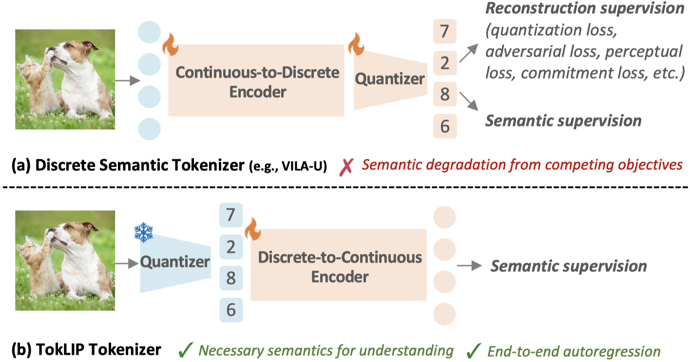

# TokLIP: Marry Visual Tokens to CLIP for Multimodal Comprehension and Generation

<h5 align="center"> 

[](https://arxiv.org/abs/2505.05422)
[](https://github.com/TencentARC/TokLIP)
[](https://huggingface.co/TencentARC/TokLIP)
[](https://github.com/TencentARC/TokLIP/blob/main/LICENSE)
 <br>

</h5>

Welcome to the official code repository for "[**TokLIP: Marry Visual Tokens to CLIP for Multimodal Comprehension and Generation**](https://arxiv.org/abs/2505.05422)".

Your star means a lot for us to develop this project! ⭐⭐⭐


## 📰 News
* [2025/06/05] 🔥 We release the code and models!
* [2025/05/09] 🚀 Our paper is available on arXiv!


## 👀 Introduction



- We introduce TokLIP, a visual tokenizer that enhances comprehension by **semanticizing** vector-quantized (VQ) tokens and **incorporating CLIP-level semantics** while enabling end-to-end multimodal autoregressive training with standard VQ tokens.

- TokLIP integrates a low-level discrete VQ tokenizer with a ViT-based token encoder to capture high-level continuous semantics.

- Unlike previous approaches (e.g., VILA-U) that *discretize high-level features*, TokLIP **disentangles training objectives for comprehension and generation**, allowing the direct application of advanced VQ tokenizers without the need for tailored quantization operations.


## 🔧 Installation
```bash
conda create -n toklip python=3.10 -y
conda activate toklip
git clone https://github.com/TencentARC/TokLIP
pip install --upgrade pip 
pip install -r requirements.txt
```


## ⚙️ Usage

### Model Weight

|  Model   | Resolution | IN Top1 | COCO TR@1 | COCO IR@1 |                            Weight                            |
| :------: | :--------: | :-----: | :-------: | :-------: | :----------------------------------------------------------: |
| TokLIP-S |    256     |  76.4   |   64.06   |   48.46   | [🤗 TokLIP_S_256](https://huggingface.co/TencentARC/TokLIP/blob/main/TokLIP_S_256.pt) |
| TokLIP-L |    384     |  80.0   |   68.00   |   52.87   | [🤗 TokLIP_L_384](https://huggingface.co/TencentARC/TokLIP/blob/main/TokLIP_L_384.pt) |

We are current working on TokLIP-XL with 512x512 resolution and it will be released soon!

### Evaluation

Please first download the TokLIP model weights.

We provide the evalution scripts for ImageNet classification  and MSCOCO Retrieval in `src\test_toklip_256.sh` and `src\test_toklip_384.sh`. 

Please revise the `--pretrained`, `--imagenet-val`, and `--coco-dir` with your specific paths.

### Inference

We provide the inference example in `src/inference.py`. 

```shell
cd src
python inference.py --model-config 'ViT-SO400M-16-SigLIP2-384-toklip' --pretrained 'YOUR_TOKLIP_PATH'
```

### Model Usage

We provide `build_toklip_encoder` function in `src/create_toklip.py`, you could direct load TokLIP with `model`, `image_size`, and `model_path` parameters.


## 🔜 TODOs
- [ ] Release training codes.
- [ ] Release TokLIP-XL with 512 resolution.


## 📂 Contact
If you have further questions, please open an issue or contact <haokun.lin@cripac.ia.ac.cn>.

Discussions and potential collaborations are also welcome.


## 🙏 Acknowledgement
This repo is build upon the following projects:

* [OpenCLIP](https://github.com/mlfoundations/open_clip)
* [LlamaGen](https://github.com/FoundationVision/LlamaGen)
* [DeCLIP](https://github.com/Sense-GVT/DeCLIP)

We thank the authors for their codes.


## 📝 Citation
Please cite our work if you use our code or discuss our findings in your own research:
```bibtex
@article{lin2025toklip,
  title={TokLIP: Marry Visual Tokens to CLIP for Multimodal Comprehension and Generation},
  author={Lin, Haokun and Wang, Teng and Ge, Yixiao and Ge, Yuying and Lu, Zhichao and Wei, Ying and Zhang, Qingfu and Sun, Zhenan and Shan, Ying},
  journal={arXiv preprint arXiv:2505.05422},
  year={2025}
}
```
